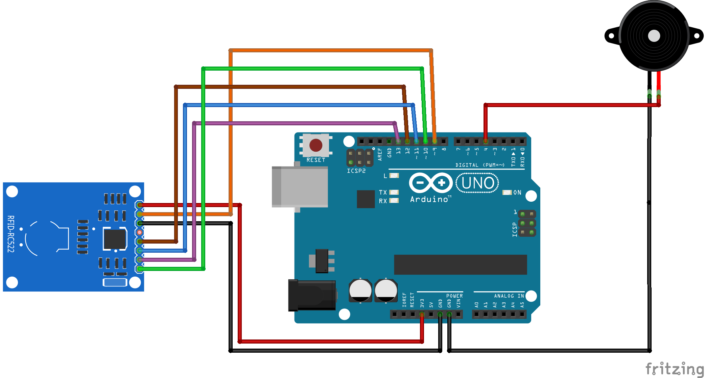

# PIE Laser Tag : Balises

## I. Choix matériel

L'objectif de cette partie est d'obtenir une balise portable, indépendante en énergie et resistante au climat ambient. Il faut donc important que la balise soit légère, alimentée par une batterie et le tout dans un boitier étanche.

### 1. Strict nécessaire
La balise doit identifier de manière unique les joueurs qui intéragissent avec, envoie la donnée au centrale et prévient l'utilisateur que le badgage à été effectué avec succès.
On utilise donc une carte `Arduino Uno` avec un lecteur RFID/NFC `MFRC522`, un module radio émetteur et une buzzer.

Pour la partie radio, on va utiliser les mêmes modules qu'avec les interfaces afin de simplifier le développement et la compatibilité.

Pour la partie lecteur RFID, on va coller des stickers RFID sur les interfaces (`Mifare Classic 1k`) et on écrit le numéro du fusil dans le bloc 1 du sticker. On utilise l'application `Mifare Classic Tools` pour écrire sur les stickers et vérifier les données. On a ensuite le lecteur connecté à l'Arduino qui utilise sa bibliotèque officielle afin de lire les stickers.

## II. Branchements
Le schéma du cablage a été fait sur `Fritzing` avec un module complémentaire pour mettre le lecteur RFID que l'on peut trouver dans le dossier `./doc`.

A noter qu'il manque le module radio qui va occuper 3 pins: un ground, une power 5V et un digital.
Il faudra aussi potentiellement rajouter une résistance sur le buzzer.

## III. Code
Le code actuel est avant tout une esquisse des différentes fonctions à utiliser pour lire un tag RFID et pour utiliser le buzzer.
Il ne reste qu'à simplifier le code en enlevant les éléments inutiles et organiser l'envoie de la donnée avec le module radio.